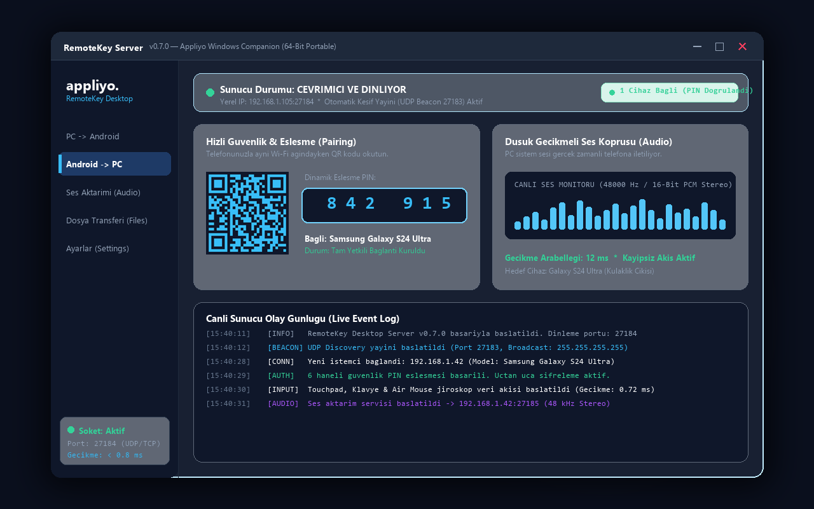

# RemoteKey Desktop Server (Windows Companion)

### Official Windows Companion Server for RemoteKey Mobile
**Ultra-low latency socket server connecting your Windows PC to Android phones, tablets, and Smart TVs.**

[-0078d4?style=for-the-badge&logo=windows&logoColor=white)](https://appliyo.net)

---

## 💻 About the Desktop Companion

**RemoteKey Server (`RemoteKey.exe`)** is the zero-install, ultra-lightweight desktop background host for RemoteKey. It listens on your local home network, pairs securely with your mobile devices via QR code or a dynamic 6-digit PIN, and executes mouse movements, keystrokes, media shortcuts, and low-latency audio streaming.

### ⚡ Key Capabilities:
- **Zero-Install & Portable**: Run directly from any folder or USB drive. No background Windows services, no registry junk.
- **Ultra-Low Latency (< 1 ms)**: Direct high-speed UDP/TCP socket communication on port `27184`.
- **Zero-Cloud & 100% Local**: Works entirely offline within your local Wi-Fi / LAN or Bluetooth. Zero telemetry, zero external relays.
- **Automatic Beacon Discovery**: Mobile devices detect your PC automatically on the local network via UDP port `27183`.
- **Lossless Audio Streaming**: Streams high-fidelity PC system audio (48 kHz / 16-bit PCM) directly to your phone's headphones.
- **Dynamic PIN Security**: One-time 6-digit PIN pairing ensures only authorized devices on your network can send input.

---

## 🚀 Quick Start

1. **Download**: Grab the standalone [`RemoteKey.exe`](https://github.com/appliyo/RemoteKey/releases/download/v0.7.0/RemoteKey.exe) from the [Releases page](https://github.com/appliyo/RemoteKey/releases) or from [appliyo.net](https://appliyo.net).
2. **Run**: Double-click `RemoteKey.exe`. When the Windows Firewall prompt appears, check *"Private Networks"* and allow access.
3. **Connect**: Open RemoteKey on your Android device — your PC will be automatically detected. Verify the 6-digit PIN and start controlling your desktop!

---

## 🌐 Official Updates & Support

- **Official Website & Downloads**: [https://appliyo.net](https://appliyo.net)
- **Official Version API**: [https://appliyo.net/api/version.json](https://appliyo.net/api/version.json)
- **Customer Support**: [info@appliyo.net](mailto:info@appliyo.net)

---

© 2026 Appliyo. RemoteKey is a registered trademark of Appliyo Technologies. All rights reserved.

